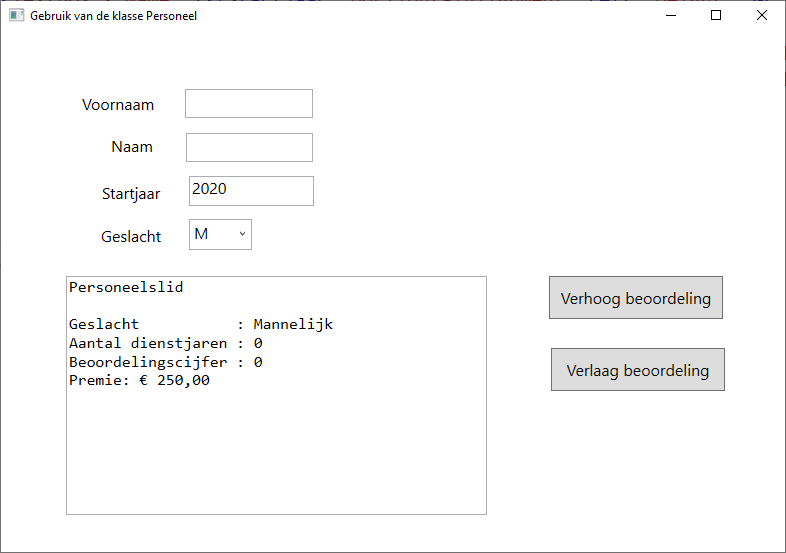
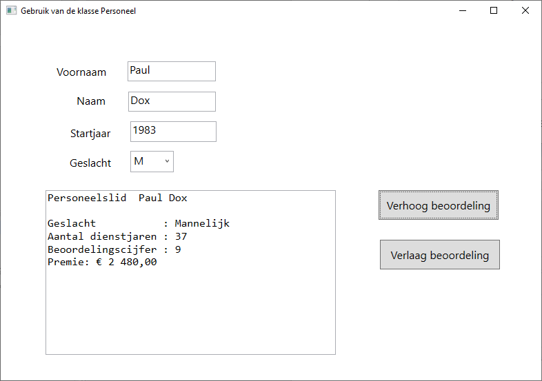

# KlassePersoneel

Maak een toepassing **Personeel** om een werknemersobject te
creëren en de gegevens van dat werknemersobject te tonen.

***Class diagram***

Je maakt voor deze toepassing eerst de (basis)klasse **Employee** met
volgende [eigenschappen]:

-   **LastName** - string.
-   **FirstName** -string.
-   **Sex** - char (waarde "M", "V" of "X").
-   **Score** -- integer waarde van minimum 0 en maximum 10.
-   **StartYear** -- integer die aangeeft in welk kalenderjaar het
    personeelslid in dienst getreden is.

Deze klasse bevat ook nog enkele "read-only" eigenschappen:

-   **YearsOfService** -- integer die het aantal dienstjaren weergeeft:
    huidig jaar wordt verminderd met het startjaar.
-   **SexDescription** -- string met als waarde "Male", "Female" of "Other" (afhankelijk van de waarde van de eigenschap Sex)
-   **Bonus** -- decimal. De premie wordt als volgt bepaald: eerst
    wordt het basisbedrag berekend: 500€, vermeerderd met 20€ per
    dienstjaar. Dit bedrag wordt gehalveerd voor personeelsleden die een
    Beoordelingscijfer hebben dat lager is dan 5. Voor diegenen die een
    beoordelingscijfer van 7 of 8 hebben, wordt het basisbedrag met 50%
    verhoogd. Voor wie een beoordelingscijfer van 9 of 10 heeft, wordt
    het basisbedrag verdubbeld.

De klasse Employee bevat volgende methodes:

-   Constructor **Employee** in 2 vormen: één zonder parameters waarbij
    een "leeg" personeelslid gecreëerd wordt en één met 5 parameters (de
    5 eerder beschreven eigenschappen, in de volgorde zoals beschreven).
-   **IncreaseScore** -- deze methode zorgt ervoor dat het
    beoordelingscijfer met 1 verhoogd wordt.
-   **DecreaseScore** -- deze methode zorgt ervoor dat het
    beoordelingscijfer met 1 verlaagd wordt.
-   **ShowSummary** -- deze functiemethode geeft een string als
    resultaat met alle informatie van het personeelslid. (zie verder
    inhoud van het tekstvak resultTextBox).

Bij de start van het programma, krijgt de gebruiker de vraag of een
"leeg" werknemersobject of een "ingevuld" werknemersobject gecreëerd
moet worden. In het eerste geval is er geen naam en voornaam (leeg), is
het geslacht "M" en het startjaar 2000. In het 2^de^ geval kies je zelf
de "invulwaarden".

Na die keuze verschijnt het venster Personeel.

Bij keuze van een "leeg" personeelsobject:

Mogelijke inhoud bij keuze van een ingevuld personeelsobject:

Het venster *Personeel* bevat volgende objecten (+ enkele
labels):

-   firstNameTextBox: toont de voornaam van het werknemersobject. Bij het
    verlaten van dit tektstvak wordt een eventuele wijziging in het
    werknemersobject uitgevoerd en ook al getoond in het tekstvak
    resultTextBox.

-   lastNameTextBox: toont de naam van het werknemersobject. Bij het verlaten
    van dit tektstvak wordt een eventuele wijziging in het
    werknemersobject uitgevoerd en ook al getoond in het tekstvak
    resultTextBox.

-   startYearTextBox: toont het startjaar (jaar van indiensttreding) van het
    werknemersobject. Bij het verlaten van dit tektstvak wordt een
    eventuele wijziging in het werknemersobject uitgevoerd en ook al
    getoond in het tekstvak resultTextBox.

-   sexComboBox: toont in een combobox het geslacht (M, V of X) van het
    werknemersobject. Bij het verlaten van dit tektstvak wordt een
    eventuele wijziging in het werknemersobject uitgevoerd en ook al
    getoond in het tekstvak resultTextBox.

-   resultTextBox (niet wijzigbaar). In dit tekstvak wordt de informatie
    van het werknemersobject getoond door oproep van de methode
    ShowSummary (afdruk zoals in de schermvoorbeelden).

-   increaseScoreButton: bij het drukken van deze knop wordt het
    beoordelingscijfer van het werknemersobject met één verhoogd en ook
    al getoond in het tekstvak resultTextBox.

-   decreaseScoreButton: bij het drukken van deze knop wordt het
    beoordelingscijfer van het werknemersobject met één verlaagd en ook
    al getoond in het tekstvak resultTextBox.
